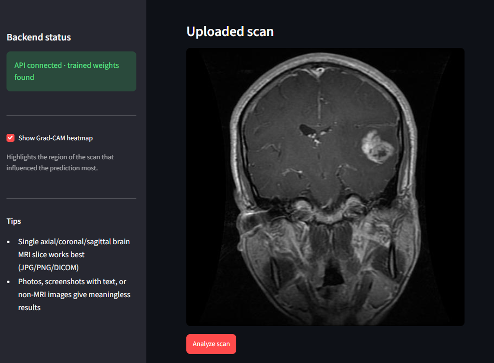
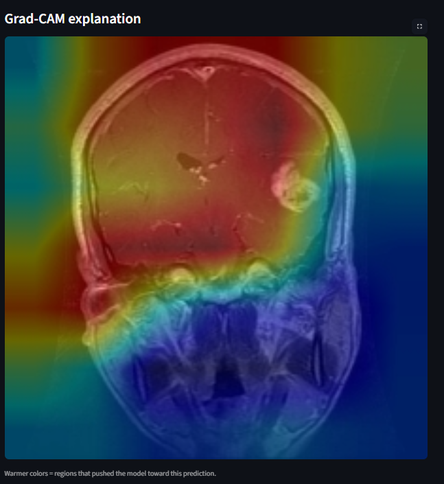
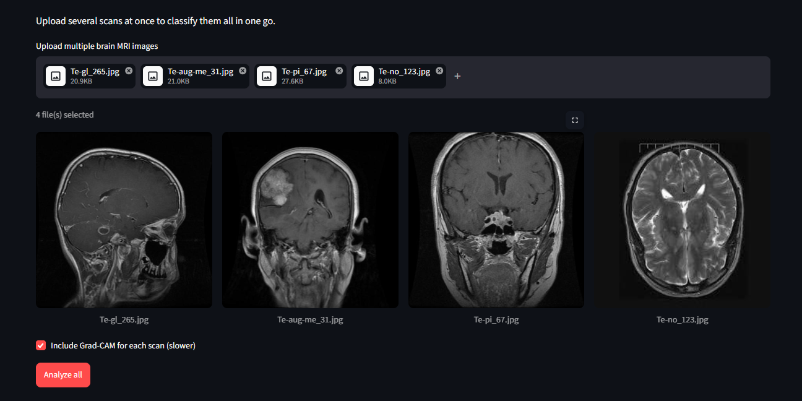
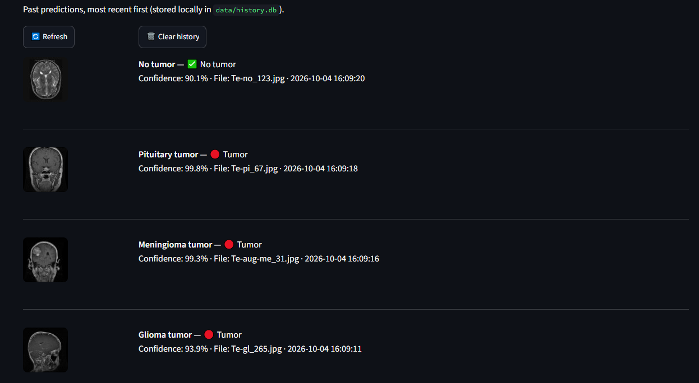

# 🧠 Brain Tumor MRI Classification — Advanced Deep Learning Project

A deep learning system that classifies brain MRI scans into **glioma**, **meningioma**, **pituitary tumor**, or **no tumor**, using transfer learning (EfficientNetB0), Grad-CAM explainability, and a full deployment stack (FastAPI backend + Streamlit frontend).

> ⚠️ **Disclaimer:** This is an educational/portfolio project. It is **not** a certified medical device and must never be used for real medical decisions. Always consult a qualified radiologist or doctor.

---

## 📸 Demo

<!-- Replace these with your own screenshots — see the "Adding screenshots" section below -->
| Upload & Prediction | Grad-CAM Explanation |
|---|---|
|  |  |

| Batch Upload | Prediction History |
|---|---|
|  |  |

---

## 🎯 Problem Statement

Radiologists reviewing brain MRI scans face high caseloads and diagnostic fatigue, which can contribute to delayed or missed tumor detection. This project builds an AI-assisted screening tool that classifies an MRI scan into one of four categories and — critically — **explains its reasoning** with a visual heatmap, so it can act as a second-opinion aid rather than an opaque black box.

## ✨ Features

- **EfficientNetB0 transfer learning** with a 3-phase training strategy (frozen head → partial fine-tune → full fine-tune), targeting 95%+ test accuracy
- **Grad-CAM explainability** — visualizes which region of the scan drove each prediction
- **FastAPI backend** with REST endpoints for single, batch, and history-aware predictions
- **Streamlit frontend** with three modes:
  - 🔍 **Single Scan** — upload one image, see prediction + confidence + Grad-CAM, download a PDF report
  - 📦 **Batch Upload** — classify multiple scans at once, with a results table and CSV export
  - 🕘 **History** — past predictions logged locally (SQLite), with thumbnails
- **DICOM (.dcm) support** in addition to standard JPG/PNG — the format real MRI machines actually output
- **PDF report generation** — a radiology-style report with the scan, Grad-CAM overlay, prediction breakdown, and general educational information
- **Non-MRI image detection** — flags uploads that are unlikely to be real grayscale MRI scans
- **Low-confidence flagging** — predictions below a confidence threshold are marked for mandatory human review, matching real clinical-support workflow design

## 🧠 Model & Methodology

| Stage | What happens |
|---|---|
| **Phase 1** | ImageNet-pretrained EfficientNetB0 backbone frozen; only the custom classification head trains |
| **Phase 2** | Top ~120 layers of the backbone unfrozen and fine-tuned at a lower learning rate |
| **Phase 3** (automatic) | If validation accuracy is still below 97% after phase 2, the entire backbone is unfrozen and fine-tuned at a very low learning rate |

**Preprocessing:** images are resized to 224×224 and kept in the 0–255 range (EfficientNet has built-in normalization). Augmentation includes rotation, zoom, shift, and contrast — **no horizontal flip**, since tumor location relative to the left/right hemisphere is diagnostically meaningful and shouldn't be artificially mirrored.

**Evaluation** goes beyond raw accuracy: per-class precision/recall/F1, confusion matrix, ROC-AUC, and **sensitivity/specificity per class** — because in this problem, missing a tumor (false negative) is far costlier than a false alarm.

## 📊 Dataset

[Brain Tumor MRI Dataset](https://www.kaggle.com/datasets/masoudnickparvar/brain-tumor-mri-dataset) (Kaggle, Masoud Nickparvar) — a combination of the Figshare, SARTAJ, and Br35H datasets. 7,023 MRI images across 4 balanced classes.

```
data/raw/
├── Training/
│   ├── glioma/        (1400 images)
│   ├── meningioma/     (1400 images)
│   ├── notumor/        (1400 images)
│   └── pituitary/      (1400 images)
└── Testing/
    ├── glioma/         (400 images)
    ├── meningioma/      (400 images)
    ├── notumor/         (400 images)
    └── pituitary/       (400 images)
```

## 📈 Results

| Metric | Score |
|---|---|
| Test Accuracy | *fill in after training* |
| Macro F1 | *fill in after training* |
| Avg. Sensitivity (tumor classes) | *fill in after training* |

*(Run the evaluation cells in the notebook to generate the confusion matrix, ROC curves, and per-class sensitivity/specificity report, then update this table.)*

## 🏗️ Project Structure

```
brain-tumor-classifier/
├── notebooks/
│   └── Brain_Tumor_Classification.ipynb   # EDA, training, evaluation, Grad-CAM
├── src/                                     # (reference implementation of the pipeline)
│   ├── preprocessing.py
│   ├── model.py
│   ├── train.py
│   ├── gradcam.py
│   └── evaluate.py
├── api/
│   └── main.py                              # FastAPI backend
├── app/
│   └── streamlit_app.py                     # Streamlit frontend
├── models/                                   # trained weights (generated, not committed)
├── data/                                     # dataset (not committed — see Setup)
├── requirements.txt
```

## 🛠️ Tech Stack

- **Deep Learning:** TensorFlow / Keras, EfficientNetB0
- **Backend:** FastAPI, Uvicorn, SQLite
- **Frontend:** Streamlit
- **Explainability:** Grad-CAM (custom implementation)
- **Other:** OpenCV, pydicom (DICOM support), fpdf2 (PDF reports), scikit-learn (metrics)

## 🚀 Setup & Usage

### 1. Clone and install
```bash
git clone https://github.com/<your-username>/brain-tumor-classifier.git
cd brain-tumor-classifier
python -m venv venv
source venv/bin/activate        # Windows: venv\Scripts\activate
pip install -r requirements.txt
```

### 2. Get the dataset
Download the [Kaggle Brain Tumor MRI Dataset](https://www.kaggle.com/datasets/masoudnickparvar/brain-tumor-mri-dataset) and place it at `data/raw/` as shown in the structure above.

### 3. Train the model
Open `notebooks/Brain_Tumor_Classification.ipynb` in Jupyter (or run it on [Google Colab](https://colab.research.google.com) with a free GPU for much faster training) and run all cells. This saves:
- `models/brain_tumor_effnet.weights.h5`
- `models/class_names.json`

### 4. Run the backend
```bash
uvicorn api.main:app --reload --port 8000
```
API docs available at `http://localhost:8000/docs`.

### 5. Run the frontend
```bash
streamlit run app/streamlit_app.py
```
Opens at `http://localhost:8501`.

## 🔌 API Reference

| Endpoint | Method | Description |
|---|---|---|
| `/health` | GET | Service and model status |
| `/classes` | GET | List of class labels |
| `/predict` | POST | Upload one image, get prediction + confidence |
| `/predict/gradcam` | POST | Same, plus a base64 Grad-CAM overlay |
| `/predict/batch` | POST | Upload multiple images, get a list of results |
| `/history` | GET | Past predictions (SQLite-backed) |
| `/history` | DELETE | Clear prediction history |

## ⚠️ Real-World Considerations & Limitations

- **Not clinically validated.** Trained on a single public dataset; real deployment would need multi-institution data, radiologist-verified labels, and regulatory clearance.
- **Confidence thresholding matters.** Predictions below a confidence threshold are flagged for mandatory human review instead of being blindly trusted — standard practice in clinical-support ML.
- **Recall over accuracy for tumor classes.** A missed tumor is far more dangerous than a false alarm, which is why sensitivity/specificity are reported per class.
- **Dataset bias.** Public MRI datasets often come from limited scanner types and populations; performance may not generalize to every hospital's equipment.

## 🔮 Possible Extensions

- Tumor segmentation (not just classification) using U-Net, for localization and size estimation
- Ensemble of multiple backbones (EfficientNet + DenseNet + ResNet) for higher accuracy
- Public deployment via Hugging Face Spaces or Streamlit Community Cloud
- User feedback loop to collect real-world correction data for retraining

## 👤 Author

**Muzammil** — BS Data Science student, Sir Syed University of Engineering & Technology (SSUET), Karachi

## 📄 License

This project is for educational purposes. Dataset credit: [Masoud Nickparvar, Kaggle](https://www.kaggle.com/datasets/masoudnickparvar/brain-tumor-mri-dataset).
